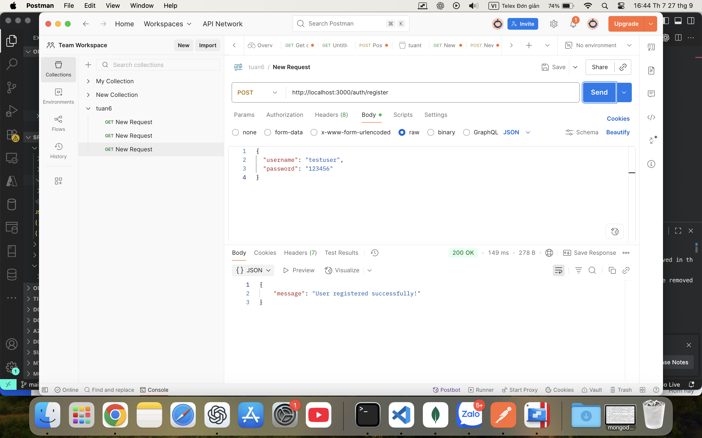
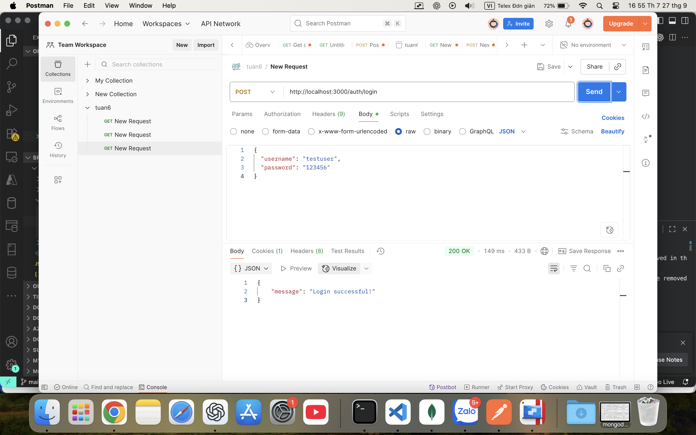
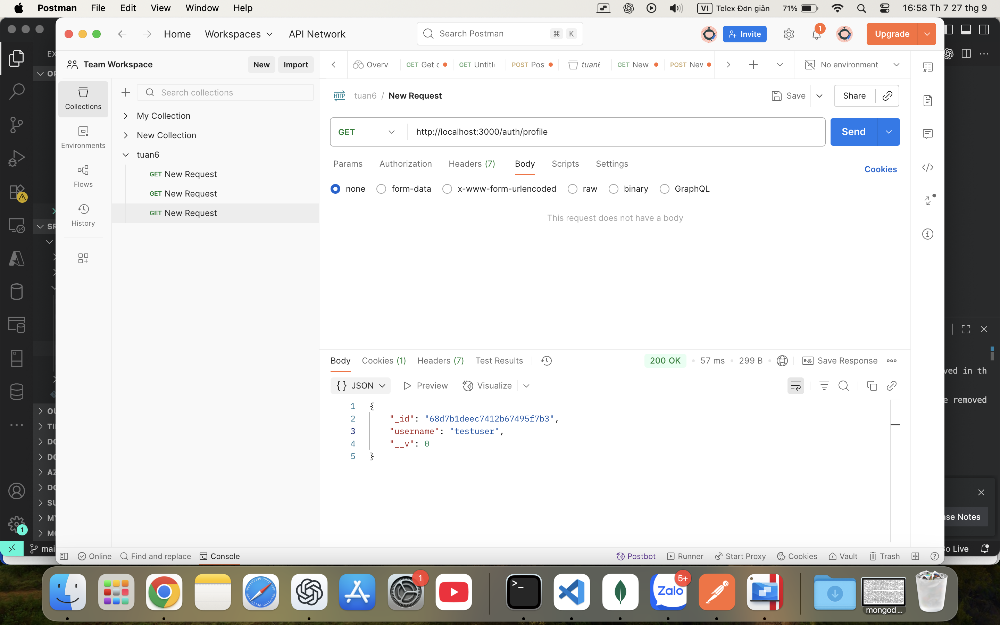
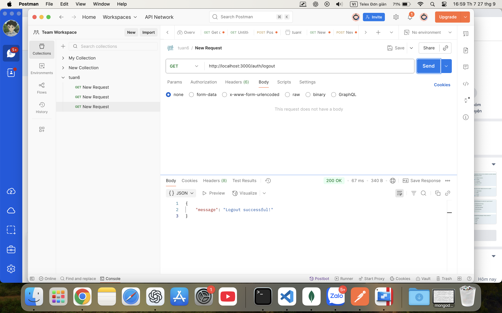
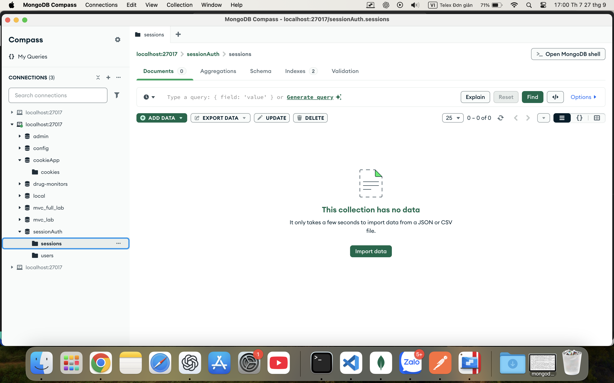
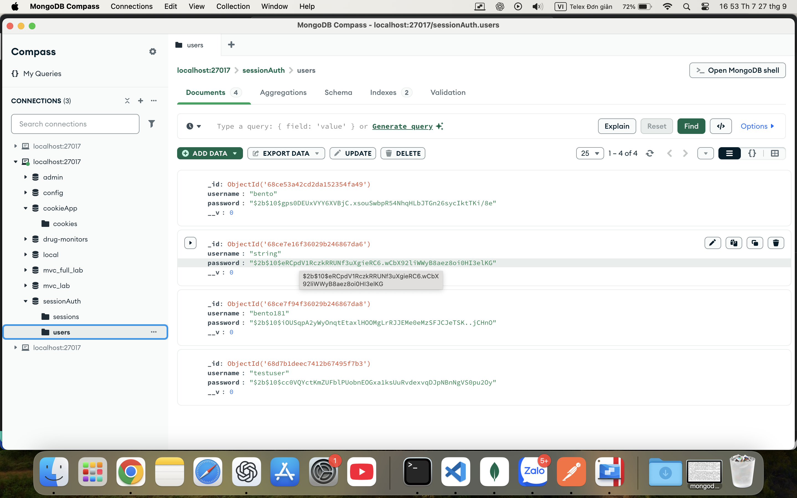
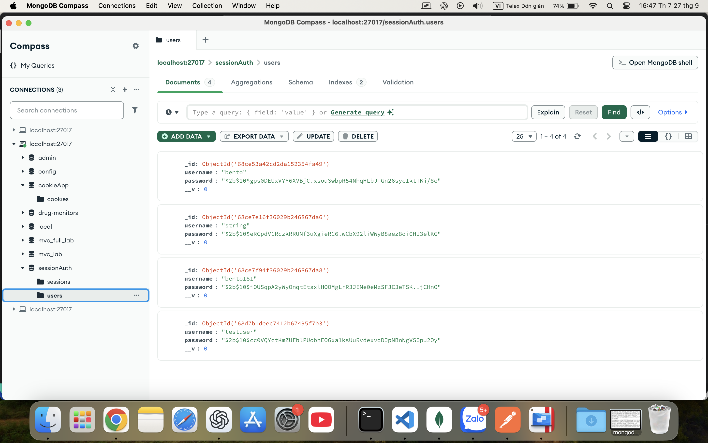
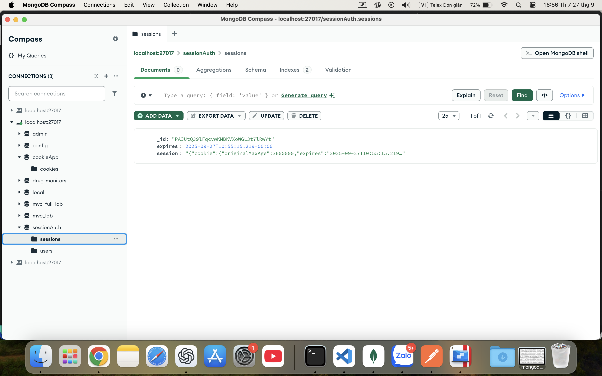

# cookie_session_auth

Đây là project thực hành xác thực người dùng sử dụng session cookie với Node.js, Express và MongoDB.

---

## Hướng dẫn test với POSTMAN

Sau khi đã cài đặt thư viện (`npm install`) và chạy ứng dụng (`node app.js`), bạn thực hiện các thao tác kiểm tra như sau:

1. **Đăng ký tài khoản:**
   - Trên POSTMAN, tạo một request mới với phương thức **POST**.
   - Nhập địa chỉ:
     ```
     http://localhost:3000/auth/register
     ```
   - Chọn tab **Body**, chọn **raw** và định dạng là **JSON**.
     - Nhập vào:
       ```json
       {
         "username": "testuser",
         "password": "123456"
       }
       ```
   - Nhấn **Send** để gửi request.

2. **Đăng nhập:**
   - Tạo một request mới với phương thức **POST**.
   - Nhập địa chỉ:
     ```
     http://localhost:3000/auth/login
     ```
   - Tab **Body**, **raw**, định dạng **JSON**:
       ```json
       {
         "username": "testuser",
         "password": "123456"
       }
       ```
   - Nhấn **Send**. Sau khi đăng nhập thành công, chuyển sang tab **Cookies** để kiểm tra cookie mà server trả về.

3. **Truy cập profile:**
   - Tạo một request mới với phương thức **GET**.
   - Nhập địa chỉ:
     ```
     http://localhost:3000/auth/profile
     ```
   - Sử dụng cookie đã nhận từ bước đăng nhập (POSTMAN sẽ tự động sử dụng cookie nếu cùng workspace).
   - Nhấn **Send** để kiểm tra kết quả trả về thông tin user.

4. **Đăng xuất:**
   - Tạo một request mới với phương thức **GET**.
   - Nhập địa chỉ:
     ```
     http://localhost:3000/auth/logout
     ```
   - Sau khi đăng xuất, vào lại tab **Cookies** để kiểm tra cookie đã bị xóa hoặc thay đổi.

---

## Ảnh kết quả test

### Kết quả đăng ký user


### Kết quả đăng nhập


### Kết quả truy cập profile


### Kết quả đăng xuất


### Cookie sau khi đăng xuất


### Kiểm tra user trên MongoDB sau khi đăng ký


### Kiểm tra sessions trên MongoDB sau khi đăng ký


### Kiểm tra sessions trên MongoDB sau khi đăng nhập


### Kiểm tra sessions trên MongoDB sau khi đăng xuất


---

**Lưu ý:** Tất cả ảnh test đều lưu trong thư mục `public/results/`.